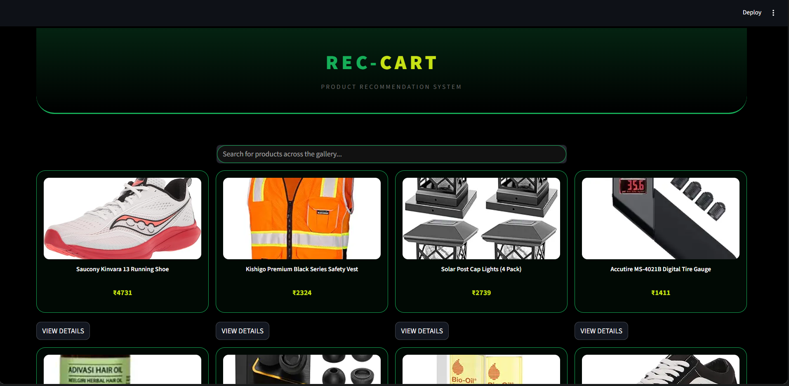
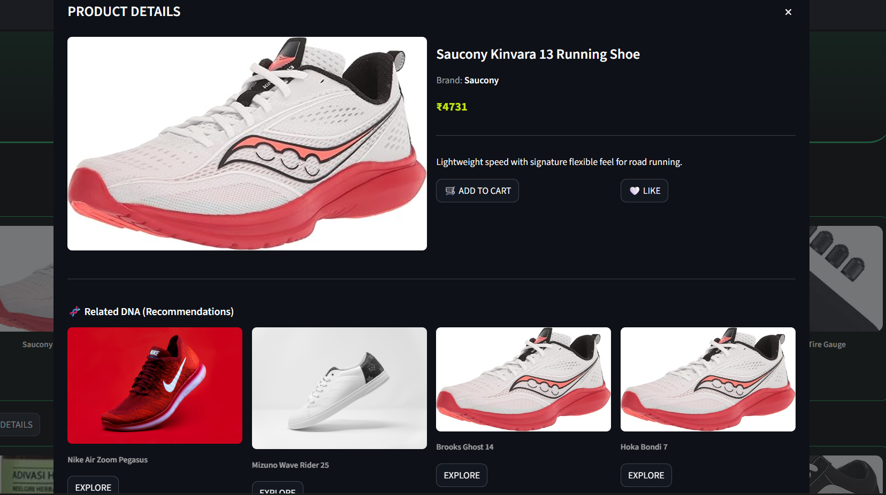
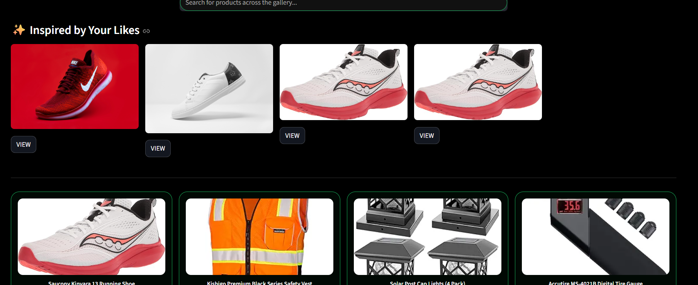

<div align="center">


<br/>


</div>

---
## `// OUR TEAM`
This project was built collaboratively by a team of **7 members** from [Rajkiya Engineering College, Ambedkar Nagar](https://recabn.ac.in/).
<div align="center">

<br/>

<table>
  <tr>
    <td align="center">
  
  <br/><b>Ansh Jaiswal</b>
  <br/>
</td>
    <td align="center">
  
  <br/><b>Gagan Kumar</b>
  <br/>
</td>
    <td align="center">
  
       <br/><b>Adarsh Kasaudhan</b>
       <br/>
    </td>
    <td align="center">
  
  <br/><b>Rishi Kumar Pathak</b>
  <br/>
</td>
    <td align="center">
  
  <br/><b>Abhinav Arya</b>
  <br/>
</td>
    <td align="center">
  
  <br/><b>Abhishek Paswan</b>
  <br/>
<td align="center">
  
  <br/><b>Harsh Shukla</b>
  <br/>
</td>
  </tr>
</table>

</div>

---

## `// OVERVIEW`

> The **Product Recommendation System** helps users discover products that match their preferences and interests. It combines **Collaborative Filtering** (based on similar users) and **Content-Based Filtering** (based on product attributes) to deliver accurate, personalized suggestions from a custom-built CSV dataset — all through an interactive **Streamlit** web interface.

---

## `// FEATURES`

| Icon | Feature | Description |
|:---:|---|---|
| 🤝 | **Collaborative Filtering** | Finds users with similar behavior and recommends what they liked |
| 📦 | **Content-Based Filtering** | Suggests products that share attributes with ones users already like |
| 🌐 | **Streamlit Web UI** | Interactive browser-based interface — easy to use for everyone |
| 📂 | **Custom CSV Dataset** | Powered by our own curated and cleaned product data |
| ⚡ | **Fast & Efficient** | Optimized processing with Pandas and Scikit-learn |

---

## `// TECH STACK`

| Technology | Purpose | Version |
|---|---|---|
|  | Core programming language | 3.8+ |
|  | Web-based user interface | Latest |
|  | Data loading and manipulation | Latest |
|  | Numerical computations | Latest |
|  | ML algorithms & similarity metrics | Latest |

---

## `// SYSTEM ARCHITECTURE & FLOW`
```text
                  +------------------+
                  |  Custom CSV Data |
                  +--------+---------+
                           |
                           v
                +--------------------+
                | data_loader.py     | (Preprocessing & Cleaning)
                +--------+-----------+
                           |
                           v
               +-----------+-----------+
               |  recommendation_model |
               +-----------+-----------+
                           |
         +-----------------+-----------------+
         |                                   |
         v                                   v
+-----------------------+           +-----------------------+
|  Content-Based Engine |           | Collaborative Engine  |
+-----------------------+           +-----------------------+
| - TF-IDF Vectorizer   |           | - User-Item Matrix    |
| - Cosine Similarity   |           | - Interaction Patterns|
+-----------------------+           +-----------------------+
         |                                   |
         +-----------------+-----------------+
                           |
                           v
               +-----------+-----------+
               |   Streamlit Frontend  | (app.py UI)
               +-----------------------+
```

### How the Algorithms Work:
Content-Based Filtering: Analyzes specific product attributes (tags, category, descriptions). It converts textual features into numerical vectors using techniques like TF-IDF and uses Cosine Similarity to recommend matching products based on a selected item.

Collaborative Filtering: Focuses on user interactions and historical behaviors. It maps interactions onto a User-Item Matrix to uncover buying patterns and highlights recommendations based on what "similar profile users" bought.

---

## `// APPLICATION INTERFACE`

*Once your app is running locally, capture screenshots of your Streamlit UI, drop them inside a folder named `screenshots/` in your repository, and update the paths below:*

#### 🖥️ Dashboard Dashboard & Overview
> *The interactive main panel displaying dataset statistics and catalog highlights.*


### 📦 2. Content-Based Search & Discovery
* **Interactive Catalog Breakdown:** Search or select a target item to instantly generate an attribute-matched matrix based on categories, descriptions, and tags.
* **Dynamic Details Pop-up:** Clicking on any individual product from the catalog opens a detailed modal view displaying the **top 4 highly similar recommended products** calculated via TF-IDF and Cosine Similarity.


### ❤️ 3. Personalized "Products You Liked" Feed
* **Affinity Tracking:** A dedicated section that monitors user-logged interactions and high-affinity items during the session.
* **Reactive Suggestions:** Leverages the hybrid backend engine to dynamically serve refined recommendations derived explicitly from items the user previously marked as liked.


---

## `// PROJECT STRUCTURE`
```text
📁 Product-Recommendation-System/
│
├──📄 products.csv            		← Custom product dataset
├── 📂 screenshots/                 ← UI reference images
├    
├── 📄 engine.py  
├── 📄 app.py                  		← Streamlit app entry point
├── 📄 data_loader.py          		← Dataset loading & preprocessing
├── 📄 requirements.txt        		← Project dependencies
└── 📄 README.md
```
---

## `// SETUP & INSTALLATION`

```bash
# ── Step 1: Clone the repository ──────────────────────────────
git clone [https://github.com/Harshtaker/Product-Recommendation-System.git](https://github.com/Harshtaker/Product-Recommendation-System.git)

# ── Step 2: Move into the project folder ──────────────────────
cd Product-Recommendation-System

# ── Step 3: Install all dependencies ──────────────────────────
pip install -r requirements.txt

# ── Step 4: Launch the Streamlit app ──────────────────────────
streamlit run app.py

# ── Open browser at ───────────────────────────────────────────
# http://localhost:8501
```


## 📄 License

This project is open source and available under the [Rajkiya Engineering College, Ambedkar Nagar](https://recabn.ac.in/)

---

<p align="center">
  Built with Team ❤️ using nothing but the <strong>Python Standard Library</strong>
</p>